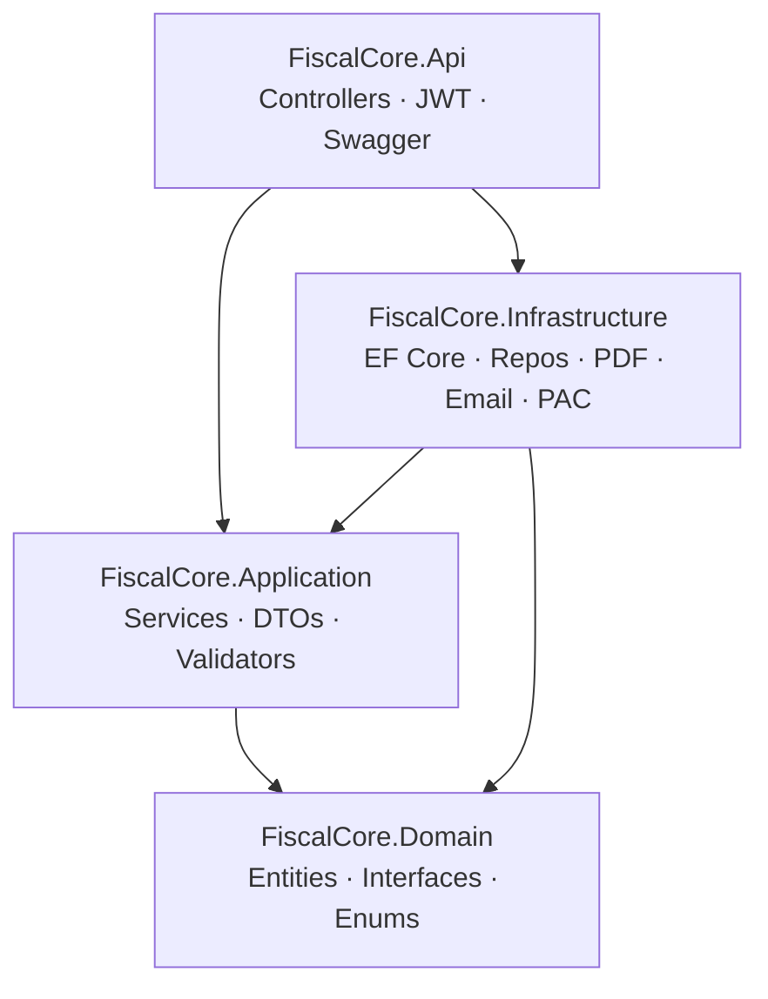
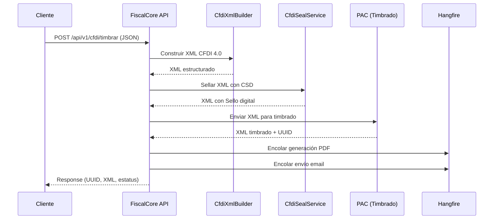

<div align="center">
  <h1>🧾 FiscalCore API</h1>
  <p>
    REST API para generación, timbrado y gestión de CFDI 4.0<br/>
    <em>Facturación electrónica mexicana · .NET 10 · SQL Server · Hangfire</em>
  </p>

[](https://dotnet.microsoft.com/)
[](https://learn.microsoft.com/en-us/dotnet/csharp/)
[](https://www.microsoft.com/sql-server)
[](LICENSE)

</div>

[Resumen](#resumen) • [Arquitectura](#arquitectura) • [Requisitos](#requisitos) • [Inicio rápido](#inicio-rápido) • [Endpoints](#endpoints) • [Configuración](#configuración) • [Base de datos](#base-de-datos)

---

## Resumen

**FiscalCore API** es un servicio RESTful construido sobre .NET 10 que automatiza el ciclo completo de facturación electrónica en México bajo el estándar **CFDI 4.0** del SAT.

La API recibe una solicitud JSON con los datos fiscales, construye el XML, lo sella digitalmente con un certificado (CSD/FIEL), lo envía a un PAC para el timbrado, y retorna el CFDI timbrado listo para su distribución. Adicionalmente genera el PDF, envía el comprobante por correo electrónico y mantiene un historial de auditoría completo.

> [!NOTE]
> El proyecto incluye un servicio de timbrado **fake** para desarrollo local. Para producción, se integra con un PAC real mediante configuración.

## Características

- **CFDI 4.0 completo** — Construcción de XML desde JSON, con soporte para emisor, receptor, conceptos, impuestos trasladados y retenidos
- **Timbrado automatizado** — Sellado digital (CSD) + timbrado vía PAC en un solo flujo
- **Generación de PDF** — Representación visual del CFDI con código QR de verificación SAT
- **Envío por correo** — Entrega automática de XML y PDF al cliente final (SMTP)
- **Catálogos SAT** — Precarga y caché en memoria de catálogos fiscales (regímenes, usos de CFDI, impuestos, etc.)
- **Autenticación JWT** — Access tokens + refresh tokens con rotación segura
- **Gestión de certificados** — Alta, consulta, actualización y revocación de CSD/FIEL con contraseñas cifradas (AES-256)
- **Auditoría** — Logs de actividad, errores y envíos de correo en base de datos separada
- **Balance de timbres** — Seguimiento de folios disponibles y consumidos por usuario
- **Procesamiento batch** — Soporte para generación masiva de CFDI y descargas por lote
- **Dashboard Hangfire** — Monitoreo de jobs en segundo plano en `/hangfire`
- **Versionado de API** — URL-based (`/api/v1/`), listo para evolucionar sin romper clientes

## Arquitectura

El proyecto sigue una arquitectura en capas con separación estricta de responsabilidades:



| Capa | Proyecto | Responsabilidad |
|------|----------|-----------------|
| **Web** | `FiscalCore.Api` | ASP.NET Core host, controladores REST, autenticación JWT, Swagger, Hangfire dashboard |
| **Aplicación** | `FiscalCore.Application` | Lógica de negocio, DTOs, validadores FluentValidation, interfaces de servicios |
| **Infraestructura** | `FiscalCore.Infrastructure` | EF Core (SQL Server), repositorios, timbrado PAC, generación PDF, envío de correo, cifrado AES, almacenamiento de archivos |
| **Dominio** | `FiscalCore.Domain` | Entidades del negocio (CFDI, Usuario, Certificado, etc.), contratos de repositorio, enumeraciones |

### Flujo de timbrado



## Stack tecnológico

| Componente | Tecnología |
|------------|-----------|
| **Runtime** | .NET 10.0 / C# 13 |
| **Framework Web** | ASP.NET Core Web API |
| **Autenticación** | JWT Bearer (`Microsoft.AspNetCore.Authentication.JwtBearer`) |
| **Versionado** | `Asp.Versioning` v8.1 (URL-based) |
| **Validación** | FluentValidation v12.1 |
| **ORM** | Entity Framework Core 10.0 + SQL Server |
| **Jobs** | Hangfire 1.8 (SQL Server storage) |
| **PDF** | QuestPDF 2025.12 |
| **QR** | QRCoder 1.7 |
| **Email** | SMTP (Gmail / Office 365) |
| **Cifrado** | AES-256-CBC |
| **Documentación** | Swagger / Swashbuckle |

## Requisitos

- [.NET 10.0 SDK](https://dotnet.microsoft.com/download/dotnet/10.0)
- [SQL Server](https://www.microsoft.com/sql-server) (2019 o superior; compatible con LocalDB, Express, o Azure SQL)
- Opcional: [EF Core CLI](https://learn.microsoft.com/ef/core/cli/dotnet) (`dotnet tool install --global dotnet-ef`)

## Inicio rápido

### 1. Clonar el repositorio

```bash
git clone <repo-url>
cd NET-FiscalCore-API
```

### 2. Configurar la aplicación

Crea o edita `src/FiscalCore.Api/appsettings.Development.json`:

```json
{
  "ConnectionStrings": {
    "DefaultConnection": "Server=localhost;Database=db;Trusted_Connection=True;TrustServerCertificate=True"
  },
  "Encryption": {
    "AesKey": "<BASE64_32_BYTES>",
    "AesIv": "<BASE64_16_BYTES>"
  },
  "Jwt": {
    "Issuer": "FiscalCore.API",
    "Audience": "FiscalCore.Client",
    "SigningKey": "<MIN_32_CHARACTERS>",
    "ExpirationMinutes": 120
  }
}
```

> [!IMPORTANT]
> Las secciones `Encryption` y `Jwt` son validadas al iniciar. Si faltan o están vacías, la aplicación **no arranca**.

### 3. Aplicar migraciones

```bash
dotnet ef database update \
  --project src/FiscalCore.Infrastructure/FiscalCore.Infrastructure.csproj \
  --startup-project src/FiscalCore.Api/FiscalCore.Api.csproj
```

### 4. Ejecutar la API

```bash
dotnet run --project src/FiscalCore.Api/FiscalCore.Api.csproj
```

La API estará disponible en:
- Swagger UI: `http://localhost:5079/swagger`
- Hangfire Dashboard: `http://localhost:5079/hangfire`

### 5. Probar un timbrado (con PAC fake)

```bash
curl -X POST http://localhost:5079/api/v1/auth/login \
  -H "Content-Type: application/json" \
  -d '{"username":"admin","password":"Admin123!"}'

# Usa el access_token en el siguiente request
curl -X POST http://localhost:5079/api/v1/cfdi/timbrar \
  -H "Content-Type: application/json" \
  -H "Authorization: Bearer <token>" \
  -d '{ ... }'
```

## Endpoints

> [!NOTE]
> Todos los endpoints excepto `/auth` requieren autenticación JWT.

### Autenticación (`/api/v1/auth`)

| Método | Ruta | Descripción |
|--------|------|-------------|
| `POST` | `/login` | Iniciar sesión → access + refresh token |
| `POST` | `/refresh` | Renovar access token |

### CFDI (`/api/v1/cfdi`)

| Método | Ruta | Descripción |
|--------|------|-------------|
| `POST` | `/timbrar` | Crear y timbrar CFDI 4.0 desde JSON |
| `GET` | `/{uuid}` | Consultar CFDI por UUID del SAT |

### PDF (`/api/v1/cfdiPdf`)

| Método | Ruta | Descripción |
|--------|------|-------------|
| `GET` | `/{uuid}` | Generar u obtener PDF del CFDI |

### Certificados (`/api/v1/certificate`)

| Método | Ruta | Descripción |
|--------|------|-------------|
| `GET` | `/{id}` | Obtener certificado por ID |
| `GET` | `/user/{userId}` | Listar certificados del usuario |
| `POST` | `/` | Registrar nuevo certificado (CER + KEY) |
| `PUT` | `/{id}` | Actualizar certificado |
| `DELETE` | `/{id}` | Revocar certificado |

### Correo (`/api/v1/email`)

| Método | Ruta | Descripción |
|--------|------|-------------|
| `POST` | `/resend` | Reenviar XML + PDF de un CFDI por email |

### Usuarios (`/api/v1/User`)

| Método | Ruta | Descripción |
|--------|------|-------------|
| `POST` | `/` | Registrar nuevo usuario |
| `PUT` | `/{id}` | Actualizar perfil de usuario |
| `DELETE` | `/{id}` | Desactivar usuario |

## Configuración

### Secciones principales

| Sección | Descripción |
|---------|-------------|
| `ConnectionStrings:DefaultConnection` | Cadena de conexión a SQL Server (datos + Hangfire) |
| `Encryption:AesKey` | Clave AES-256 en Base64 (32 bytes) para cifrar contraseñas de certificados |
| `Encryption:AesIv` | Vector de inicialización AES en Base64 (16 bytes) |
| `Jwt:SigningKey` | Clave de firma para tokens JWT (mín. 32 caracteres) |
| `Jwt:ExpirationMinutes` | Duración del access token en minutos |
| `Pac:Url` | URL del servicio de timbrado del PAC |
| `Pac:Username` / `Pac:Password` | Credenciales del PAC |
| `Storage:BasePath` | Ruta base para almacenar XMLs y PDFs en disco |
| `Email:Smtp` | Configuración SMTP para envío de correos |

> [!WARNING]
> Los archivos `appsettings.*.json` están en `.gitignore`. Nunca subas credenciales reales al repositorio.

## Base de datos

### Contextos

El proyecto utiliza **dos contextos EF Core**:

| Contexto | Propósito |
|----------|-----------|
| `FiscalCoreDbContext` | Entidades de negocio: usuarios, CFDI, certificados, timbres, catálogos SAT |
| `LoggingDbContext` | Registros de auditoría: actividad, errores, correos enviados |

### Migraciones

Las migraciones se almacenan en `src/FiscalCore.Infrastructure/Persistence/Migrations/`.

```bash
# Crear nueva migración
dotnet ef migrations add <Nombre> \
  --project src/FiscalCore.Infrastructure/FiscalCore.Infrastructure.csproj \
  --startup-project src/FiscalCore.Api/FiscalCore.Api.csproj \
  --output-dir Persistence/Migrations

# Aplicar migraciones pendientes
dotnet ef database update \
  --project src/FiscalCore.Infrastructure/FiscalCore.Infrastructure.csproj \
  --startup-project src/FiscalCore.Api/FiscalCore.Api.csproj
```

## Estructura del proyecto

```
NET-FiscalCore-API/
├── FiscalCore.slnx
├── src/
│   ├── FiscalCore.Api/               # Web API · Controllers · Program.cs
│   │   ├── Controllers/V1/           # Controladores REST versionados
│   │   └── Properties/
│   ├── FiscalCore.Application/       # Capa de aplicación
│   │   ├── Abstractions/             # IUnitOfWork
│   │   ├── BackgroundJobs/           # Definiciones de jobs Hangfire
│   │   ├── DTOs/                     # Objetos de transferencia
│   │   ├── Interfaces/               # Contratos de servicios
│   │   ├── Services/                 # Implementaciones de negocio
│   │   └── Validators/               # Validadores FluentValidation
│   ├── FiscalCore.Domain/            # Capa de dominio
│   │   ├── Entities/                 # Modelos de negocio
│   │   ├── Enums/                    # Enumeraciones
│   │   └── Interfaces/              # Contratos de repositorio/dominio
│   └── FiscalCore.Infrastructure/    # Capa de infraestructura
│       ├── BackgroundJobs/           # Implementación de jobs Hangfire
│       ├── CfdiBuilder/              # Constructor de XML CFDI 4.0
│       ├── Email/                    # Servicio SMTP
│       ├── Pac/                      # Integración con PAC
│       ├── Pdf/                      # Generación de PDF con QuestPDF
│       ├── Persistence/              # EF Core · DbContexts · Migrations
│       ├── Resources/                # XSDs embebidos · Recursos
│       ├── Security/                 # JWT · Cifrado AES
│       └── Storage/                  # Archivos (XML/PDF)
└── tests/
    └── FiscalCore.UnitTests/         # Tests unitarios
```

## Comandos útiles

```bash
# Restaurar y compilar
dotnet restore FiscalCore.slnx
dotnet build FiscalCore.slnx

# Ejecutar API
dotnet run --project src/FiscalCore.Api/FiscalCore.Api.csproj

# Ejecutar tests
dotnet test tests/FiscalCore.UnitTests/FiscalCore.UnitTests.csproj

# Ejecutar un test específico
dotnet test tests/FiscalCore.UnitTests/FiscalCore.UnitTests.csproj \
  --filter "FullyQualifiedName~Namespace.Class.TestMethod"
```

---

## Notas de desarrollo

- El proyecto por defecto usa un **servicio de timbrado fake** (`FakeStampingService`) para desarrollo. Para conectar un PAC real, configura la sección `Pac` en `appsettings.json` y registra `PaxStampingService` en `DependencyInjection.cs`.
- Los catálogos del SAT se precargan al iniciar la aplicación mediante `SatCatalogWarmupHostedService` y se mantienen en caché (`IMemoryCache`).
- QuestPDF se usa bajo licencia comunitaria — revisa los [términos](https://www.questpdf.com/license/) si planeas uso comercial.
- La API usa **URL versioning**: todos los endpoints están bajo `/api/v{version}/`. La versión por defecto es `1.0`.
